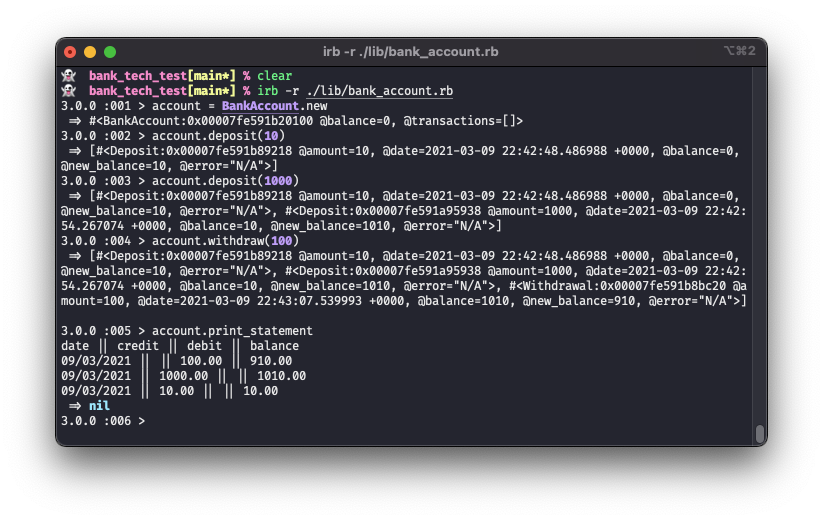
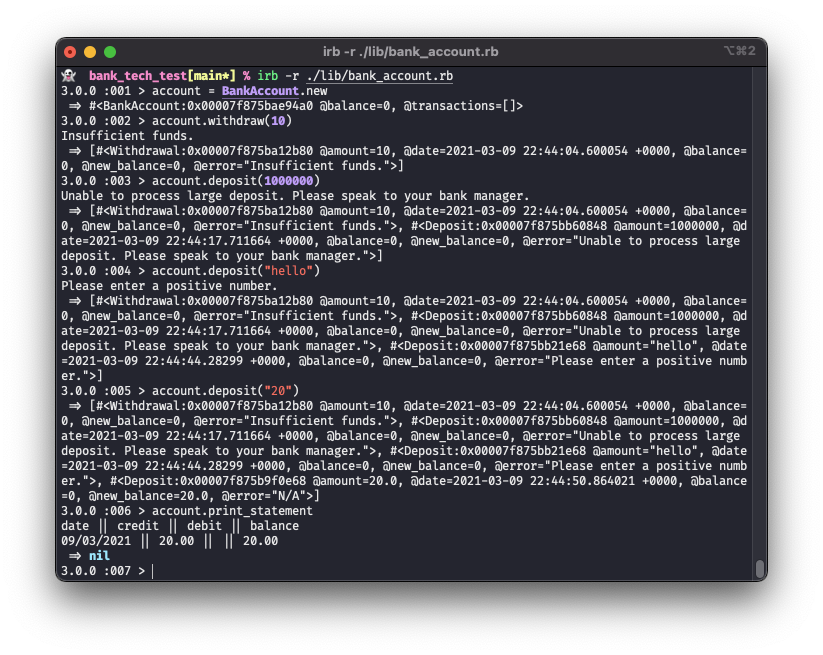

# Bank Account Tech Test

[](https://github.com/rubocop/rubocop)

A command line bank account app, in Ruby.

## Description

This project was part of the [Makers Academy](https://makers.tech) coding bootcamp. The goal was to produce the best code possible, as if it were a real tech test for an interview.  

No further development is planned.  

This was the provided specification:  
**Requirements**  
* You should be able to interact with your code via a REPL like IRB or the JavaScript console. (You don't need to implement a command line interface that takes input from STDIN.)
* Deposits, withdrawal.
* Account statement (date, amount, balance) printing.
* Data can be kept in memory (it doesn't need to be stored to a database or anything).

**Acceptance criteria**  
Given a client makes a deposit of 1000 on 10-01-2012  
And a deposit of 2000 on 13-01-2012  
And a withdrawal of 500 on 14-01-2012  
When she prints her bank statement  
Then she would see  

```
date || credit || debit || balance
14/01/2012 || || 500.00 || 2500.00
13/01/2012 || 2000.00 || || 3000.00
10/01/2012 || 1000.00 || || 1000.00
```
    
How it looks:
  
Seeing error messages for invalid inputs:  
    
  
## Installation and Usage

This project was written using Ruby v3.0.0.

**Installation**
* Make sure Ruby and Bundler are installed on your machine.
* Clone this git repo, and navigate to the cloned folder.
* Run `bundle` to install gems.

**Running tests**
* Run `rspec` to run the test suite.

**Using the app**
* Run `irb -r ./lib/bank_account` to run the irb Ruby REPL with the main bank_account.rb file loaded in.
* Create a new bank account by entering `account = BankAccount.new`.
* Deposit money with eg `account.deposit(10)` to deposit £10.
* Withdraw money using eg `account.withdraw(10)`.
* Get a bank statement by running `account.print_statement`.

## Technical details

This project has 100% test coverage, according to the SimpleCov gem. Feature/integration and unit tests are included, written in Rspec. The unit tests are fully isolated between classes.  

* The main class is BankAccount, which stores the current balance and transaction history, and manages user activities.
* Making deposits and withdrawals, and printing a statement, are done through BankAccount, providing a nice user experience.
* The Transaction class handles deposits and withdrawals. Transactions store the amount of money involved, the date, and the balance after the transaction occurs. They also contain information about whether the transaction is successful or if there was an error, eg an invalid input amount.
* Statements are also a separate class, which processes a transaction history into a formatted statement to print out.  
* Although BankAccount is dependent on Transaction and Statement, I decided to keep them separate to optimise the Single Responsibility Principle, and keep class sizes within a reasonable number of lines.

* To improve user experience, it's possible to enter amounts as strings as well as numbers.
* The user input happens within BankAccount, therefore BankAccount also has the responsibility for sanitising the inputs (arguments) for the deposit and withdraw methods.
* If the user enters an invalid amount for a transaction, they get an appropriate error message printed out. For example, "Insufficient funds." if they try to withdraw more money than is in the account.
* Unsuccessful transactions are still stored in the transaction history, but they don't show up on the printed statement.   
* To be more like a real bank, there's a limit on depositing or withdrawing too much in one go.
  
### Known issues
* I'm using Floats for the amounts. This isn't ideal for money because of how rounding works. A quick fix would be to store all the money as Integers in pence, ie x100. And also prevent users from entering more than 2 decimal places for transaction amount.
* Not really an issue because it wasn't in the specification anyway, but actually in real banks the limit on depositing or withdrawing too much is capped daily, rather than per transaction. That's not a trivial feature to add as the Transactions don't currently know anything about transaction history.


